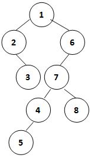

# PAT（甲级）2020年秋季考试

## 难点分析

1. 第一题和练习题中的 [1101 Quick Sort](https://pintia.cn/problem-sets/994805342720868352/problems/994805366343188480) 有点像，都是分别从两个方向进行扫描，这道题还简单一点。
2. 第二题送分题，有手就行。
3. 第三题用前序+中序重建二叉树，也见过很多次了。
4. 第四题有些复杂，先要判断给的图中是否有环，然后给出每一个终点的最短路径。
   1. 判断是否有环我用了「拓扑排序」的方法，练习题中有一道相关的题目：[1146 Topological Order](https://pintia.cn/problem-sets/994805342720868352/problems/994805343043829760)
   2. 因为入度为0的节点不唯一，所以到指定终点可以有多条最短路径，如果要多次 dijkstra 那未免太过复杂，我的方法是新增一个节点，这个节点到所有入度为0到节点的距离均为0，然后把这个节点当作源点使用 dijkstra 算法，同时用一个 pre 数组记录最短路径中当前节点的前一个节点。最后用 DFS 递归得到路径。
   3. 在网上看到有人用 SPFA 算法做这道题，效率非常高，但是我还没有跑通，之后弄清楚了再写一个 SPFA 版本的解答。


## 7-1 Panda and PP Milk (20 分)


PP milk （盆盆奶）is Pandas' favorite. They would line up to enjoy it as show in the picture. On the other hand, they could drink in peace only if they believe that the amount of PP milk is fairly distributed, that is, fatter panda can have more milk, and the ones with equal weight may have the same amount. Since they are lined up, each panda can only compare with its neighbor(s), and if it thinks this is unfair, the panda would fight with its neighbor.

Given that the minimum amount of milk a panda must drink is 200 ml. It is only when another bowl of milk is at least 100 ml more than its own that a panda can sense the difference.

Now given the weights of a line of pandas, your job is to help the breeder（饲养员）to decide the minimum total amount of milk that he/she must prepare, provided that the pandas are lined up in the given order.

### Input Specification:

Each input file contains one test case. For each case, first a positive integer $n (\leq 10^4)$ is given as the number of pandas. Then in the next line, $n$ positive integers are given as the weights (in kg) of the pandas, each no more than 200. the numbers are separated by spaces.

### Output Specification:

For each test case, print in a line the minimum total amount of milk that the breeder must prepare, to make sure that all the pandas can drink in peace.

### Sample Input:

```in
10
180 160 100 150 145 142 138 138 138 140
```

### Sample Output:

```out
3000
```

### Hint:

The distribution of milk is the following:

```
400 300 200 500 400 300 200 200 200 300
```


## 7-2 How Many Ways to Buy a Piece of Land (25 分)

The land is for sale in CyberCity, and is divided into several pieces. Here it is assumed that each piece of land has exactly two neighboring pieces, except the first and the last that have only one. One can buy several contiguous（连续的） pieces at a time. Now given the list of prices of the land pieces, your job is to tell a customer in how many different ways that he/she can buy with a certain amount of money.

### Input Specification:

Each input file contains one test case. Each case first gives in a line two positive integers: $N (\leq10^4)$, the number of pieces of the land (hence the land pieces are numbered from 1 to *N* in order), and $M (\leq10^9)$, the amount of money that your customer has.

Then in the next line, $N$ positive integers are given, where the $i$-th one is the price of the $i$-th piece of the land.

It is guaranteed that the total price of the land is no more than $10^9$.

### Output Specification:

For each test case, print the number of different ways that your customer can buy. Notice that the pieces must be contiguous.

### Sample Input:

```in
5 85
38 42 15 24 9
```

### Sample Output:

```out
11
```

### Hint:

The 11 different ways are:

```
38
42
15
24
9
38 42
42 15
42 15 24
15 24
15 24 9
24 9
```


## 7-3 Left-View of Binary Tree (25 分)

The **left-view** of a binary tree is a list of nodes obtained by looking at the tree from left hand side and from top down. For example, given a tree shown by the figure, its left-view is { 1, 2, 3, 4, 5 }



Given the inorder and preorder traversal sequences of a binary tree, you are supposed to output its left-view.

### Input Specification:

Each input file contains one test case. For each case, the first line contains a positive integer $N (\leq20)$, which is the total number of nodes in the tree. Then given in the following 2 lines are the inorder and preorder traversal sequences of the tree, respectively. All the keys in the tree are distinct positive integers in the range of **int**.

### Output Specification:

For each case, print in a line the left-view of the tree. All the numbers in a line are separated by exactly 1 space, and there must be no extra space at the beginning or the end of the line.

### Sample Input:

```in
8
2 3 1 5 4 7 8 6
1 2 3 6 7 4 5 8
```

### Sample Output:

```out
1 2 3 4 5
```


## 7-4 Professional Ability Test (30 分)

Professional Ability Test (PAT) consists of several series of subject tests. Each test is divided into several levels. Level A is a **prerequisite (前置要求)** of Level B if one must pass Level A with a score no less than *S* in order to be qualified to take Level B. At the mean time, one who passes Level A with a score no less than *S* will receive a voucher（代金券）of *D* yuans (Chinese dollar) for taking Level B.

At the moment, this PAT is only in design and hence people would make up different plans. A plan is **NOT** consistent if there exists some test T so that T is a prerequisite of itself. Your job is to test each plan and tell if it is a consistent one, and at the mean time, find the easiest way (with minimum total *S*) to obtain the certificate of any subject test. If the easiest way is not unique, find the one that one can win the maximum total value of vouchers.

### Input Specification:

Each input file contains one test case. For each case, the first line gives two positive integers *N* (≤1000) and *M*, being the total numbers of tests and prerequisite relations, respectively. Then *M* lines follow, each describes a prerequisite relation in the following format:

```
T1 T2 S D
```

where `T1` and `T2` are the indices (from 0 to *N*−1) of the two distinct tests; `S` is the minimum score (in the range (0, 100]) required to pass `T1` in order to be qualified to take `T2`; and `D` is the value of the voucher (in the range (0, 500]) one can receive if one passes `T1` with a score no less than `S` and plan to take `T2`. It is guaranteed that at most one pair of `S` and `D` are defined for a prerequisite relation.

Then another positive integer *K* (≤*N*) is given, followed by *K* queries of tests. All the numbers in a line are separated by spaces.

### Output Specification:

Print in the first line `Okay.` if the whole plan is consistent, or `Impossible.` if not.

If the plan is consistent, for each query of test `T`, print in a line the easiest way to obtain the certificate of this test, in the format:

```
T0->T1->...->T
```

However, if `T` is the first level of some subject test (with no prerequisite), print `You may take test T directly.` instead.

If the plan is impossible, for each query of test `T`, check if one can take it directly or not. If the answer is yes, print in a line `You may take test T directly.`; or print `Error.` instead.

### Sample Input 1:

```in
8 15
0 1 50 50
1 2 20 20
3 4 90 90
3 7 90 80
4 5 20 20
7 5 10 10
5 6 10 10
0 4 80 60
3 1 50 45
1 4 30 20
1 5 50 20
2 4 10 10
7 2 10 30
2 5 30 20
2 6 40 60
8
0 1 2 3 4 5 6 7
```

### Sample Output 1:

```out
Okay.
You may take test 0 directly.
0->1
0->1->2
You may take test 3 directly.
0->1->2->4
0->1->2->4->5
0->1->2->6
3->7
```

### Sample Input 2:

```in
4 5
0 1 1 10
1 2 2 10
3 0 4 10
3 2 5 10
2 0 3 10
2
3 1
```

### Sample Output 2:

```out
Impossible.
You may take test 3 directly.
Error.
```