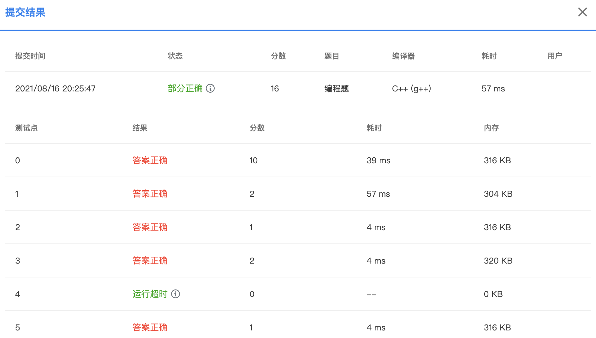
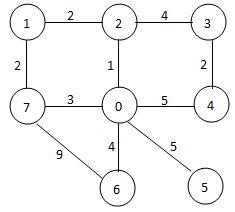

# PAT（甲级）2021年春季考试

## 难点分析

1. 个人觉得最麻烦的是第一题，暴力法很快就能写出来，但是有一个测试点会不通过，想要 AC 需要动些脑筋。
2. 第二题和第三题都挺简单的，一遍过。
3. 第四题考查最短路径，但是选择路径的策略已经给出，可能是想让考生留出时间翻回去做第一题吧。


## 7-1 Arithmetic Progression of Primes (20 分)

In mathematics, an arithmetic progression (AP，等差数列) is a sequence of numbers such that the difference between the consecutive terms is constant. In 2004, Terence Tao (陶哲轩) and Ben Green proved that for any positive *n*, there exists at least one arithmetic progression consists of *n* consecutive prime numbers. For example, { 7，37，67，97，127，157 } is one solution for *n*=6. Now it is your job to find a maximum solution for a given $n$ within a given range.

### Input Specification:

Each input file contains one test case, which gives two positive integers in a line: *n* (≤10), the number of consecutive prime terms in an arithmetic progression, and $MAXP(2 \leq MAXP < 10^5)$, the upper bound of the largest prime in the solution.

### Output Specification:

For each test case, if there exists a solution, print in ascending order the prime numbers in a line. If the solution is not unique, output the one with the maximum common difference. If there is still a tie, print the one with the maximum first number. If there is no solution bounded by $MAXP$, output the largest prime in the given range instead.

All the numbers in a line must be separated by a space, and there must be no extra space at the beginning or the end of the line.

### Sample Input 1:

```in
5 1000
```

### Sample Output 1:

```out
23 263 503 743 983
```

### Sample Input 2:

```in
10 200
```

### Sample Output 2:

```out
199
```




## 7-2 Lab Access Scheduling (25 分)

Nowadays, we have to keep a safe social distance to stop the spread of virus due to the COVID-19 outbreak. Consequently, the access to a national lab is highly restricted. Everyone has to submit a request for lab use in advance and is only allowed to enter after the request has been approved. Now given all the personal requests for the next day, you are supposed to make a feasible plan with the maximum possible number of requests approved. It is required that at most one person can stay in the lab at any particular time.

### Input Specification:

Each input file contains one test case. Each case starts with a positive integer $N (\leq2×10^3)$, the number of lab access requests. Then *N* lines follow, each gives a request in the format:

```
hh:mm:ss hh:mm:ss
```

where `hh:mm:ss` represents the time point in a day by hour:minute:second, with the earliest time being `00:00:00` and the latest `23:59:59`. For each request, the two time points are the requested entrance and exit time, respectively. It is guaranteed that the exit time is after the entrance time.

Note that all times will be within a single day. Times are recorded using a 24-hour clock.

### Output Specification:

The output is supposed to give the total number of requests approved in your plan.

### Sample Input:

```in
7
18:00:01 23:07:01
04:09:59 11:30:08
11:35:50 13:00:00
23:45:00 23:55:50
13:00:00 17:11:22
06:30:50 11:42:01
17:30:00 23:50:00
```

### Sample Output:

```out
5
```

### Hint:

All the requests can be approved except the last two.


## 7-3 Structure of Max-Heap (25 分)

In computer science, a **max-heap** is a specialized tree-based data structure that satisfies the heap property: if P is a parent node of C, then the key (the value) of P is greater than or equal to the key of C. A common implementation of a heap is the binary heap, in which the tree is a complete binary tree.

Your job is to first insert a given sequence of integers into an initially empty max-heap, then to judge if a given description of the resulting heap structure is correct or not. There are 5 different kinds of description statements:

- `x is the root`
- `x and y are siblings`
- `x is the parent of y`
- `x is the left child of y`
- `x is the right child of y`

### Input Specification:

Each input file contains one test case. For each case, the first line gives 2 positive integers: *N* (≤1,000), the number of keys to be inserted, and *M* (≤20), the number of statements to be judged. Then the next line contains *N* distinct integer keys in $[−10^4,10^4]$ which are supposed to be inserted into an initially empty max-heap. Finally there are *M* lines of statements, each occupies a line.

### Output Specification:

For each statement, print `1` if it is true, or `0` if not. All the answers must be print in one line, without any space.

### Sample Input:

```in
5 6
23 46 26 35 88
35 is the root
46 and 26 are siblings
88 is the parent of 46
35 is the left child of 26
35 is the right child of 46
-1 is the root
```

### Sample Output:

```out
011010
```


## 7-4 Recycling of Shared Bicycles (30 分)

There are many spots for parking the shared bicycles in Hangzhou. When some of the bicycles are broken, the management center will receive a message for sending a truck to collect them. Now given the map of city, you are supposed to program the collecting route for the truck. The strategy is a simple greedy method: the truck will always move to the nearest spot to collect the broken bicycles. If there are more than one nearest spot, take the one with the smallest index.

### Input Specification:

Each input file contains one test case. For each case, the first line contains two positive integers: *N* (≤ 200), the number of spots (hence the spots are numbered from 1 to *N*, and the management center is always numbered 0), and *M*, the number of streets connecting those spots. Then *M* lines follow, describing the streets in the format:

```
S1 S2 Dist
```

where `S1` and `S2` are the spots at the two ends of a street, and `Dist` is the distance between them, which is a positive integer no more than 1000. It is guaranteed that each street is given once and `S1` is never the same as `S2`.

### Output Specification:

For each case, first print in a line the sequence of spots in the visiting order, starting from 0. If it is impossible to collect all the broken bicycles, output in the second line those spots that cannot be visited, in ascending order of their indices. Or if the job can be done perfectly, print in the second line the total moving distance of the truck.

All the numbers in a line must be separated by 1 space, and there must be no extra space at the beginning or the end of the line.

### Sample Input 1 (shown by the figure below):

```in
7 10
0 2 1
0 4 5
0 7 3
0 6 4
0 5 5
1 2 2
1 7 2
2 3 4
3 4 2
6 7 9
```



### Sample Output 1:

```out
0 2 1 7 6 3 4 5
33
```

### Sample Input 2:

```in
7 8
0 2 1
0 4 5
0 7 3
1 2 2
1 7 2
2 3 4
3 4 2
6 5 1
```

### Sample Output 2:

```out
0 2 1 7 3 4
5 6
```