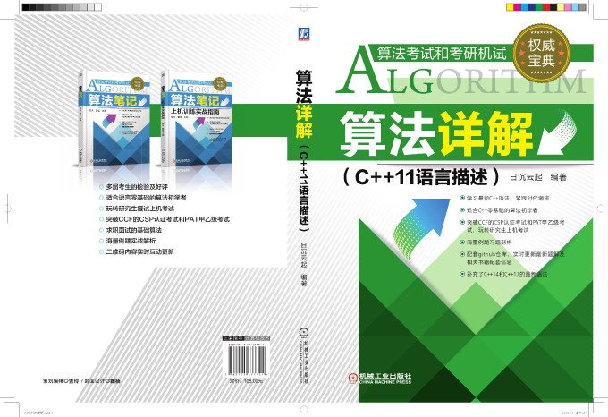

# PAT-A

2019 年以后 PAT 的真题不再以习题的方式更新在题库中，而是需要在「教育超市」中付费购买，虽然网上有很多博主给出了题目和自己的解答，但是无法在线提交就无法确认是否能够通过所有的测试点。所以虽然明知是圈钱，还是买了每次考试的习题来做。

我会在这个仓库中上传自己的解答。代码没有经过详细推敲，也没有详细注释。大概率不是最优解法，也不能保证一定是正确的，只保证能够通过 PAT 的所有测试点。有空的话会优化一下。

目前我的 C++ 知识都学自 [richenyunqi](https://github.com/richenyunqi/CCF-CSP-and-PAT-solution) 的《算法详解》一书，非常感谢他。



## 注

1. 代码默认使用如下模板：

```cpp
#include <bits/stdc++.h>
using namespace std;
using gg = long long;

int main(){
    ios::sync_with_stdio(false);
    cin.tie(0);

    return 0;
}
```


2. 为了更好的阅读体验，可以安装[MathJax Plugin for Github](https://chrome.google.com/webstore/detail/mathjax-plugin-for-github/ioemnmodlmafdkllaclgeombjnmnbima)，对`github`上`markdown`文本的`latex`语法进行渲染。
